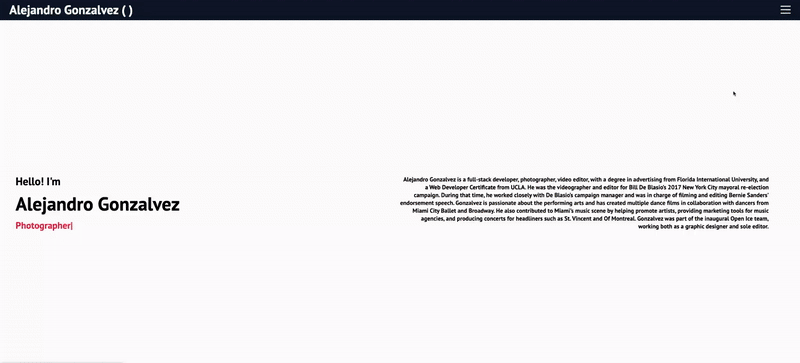

# My Portfolio

  
## Description
This is my portfolio website, which showcases some of my latest projects. It also provides a brief professional summary, my contact information, and my resume. Technologies used include:
- React
- React Hooks
- Scss
- iTyped
- Google Fonts
- FontAwesome

## Table of Contents 
- [Installation](#installation)
- [Usage](#usage)
- [License](#license)
- [Contributors](#contributors)
- [Testing](#test)
- [Questions](#questions)
## Installation
1) Copy the projects package.json 2) Run npm install on your Terminal or Gitbash
## Usage
-  
- [Link to Portfolio](https://agonzalvez.github.io/react-portfolio/)
## License
This application is under the MIT license.  
## Contributors
N/A.
## Testing
This application was tested using N/A
## Questions
For more information, please visit [GitHub Profile](https://github.com/agonzalvez/).  
For any questions, you may email me at agonzalvez1@gmail.com.